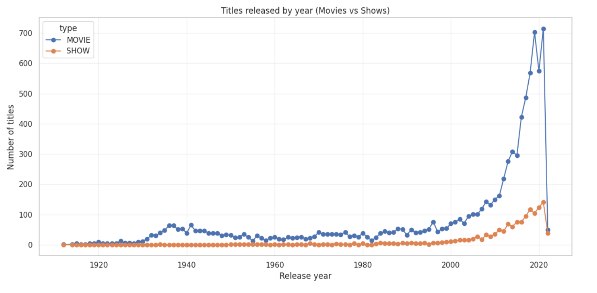
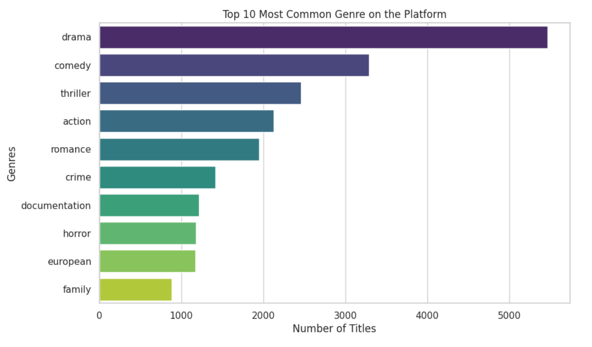

# 🎬 Amazon Prime EDA Project  

📊 **Tools Used**: Python (Pandas, NumPy, Matplotlib, Seaborn) | Google Colab  

---

## 📌 Project Overview  
This project performs **Exploratory Data Analysis (EDA)** on an Amazon Prime dataset to extract insights about the distribution of content, popular genres, release trends, and ratings.  

The goal of this analysis is to:  
- Understand Amazon Prime’s content library  
- Identify patterns in movie/show releases  
- Explore the relationship between genres, release years, and content type  

---

## 🔑 Key Insights  
- Distribution of movies vs. TV shows across years  
- Top contributing countries and directors  
- Most common genres/categories  
- Ratings distribution (e.g., TV-MA, PG, etc.)  
- Trends in content growth over time  

---

## 📂 Project Files  
- `AmazonPrime_EDA_Project.ipynb` → Jupyter Notebook with complete analysis    
- 🚫 **Dataset not included** (confidential / not public).  
- 📸 Screenshots of analysis results (see below). 
---
## 📸 Sample Visualizations  

Content added over the years:  
  

Top genres on Amazon Prime:  
  
 

## 🚀 How to Run the Project  
1. Open the notebook in **Google Colab** or Jupyter Notebook.  
2. Install required libraries if running locally:  
   ```bash
   pip install pandas numpy matplotlib seaborn
